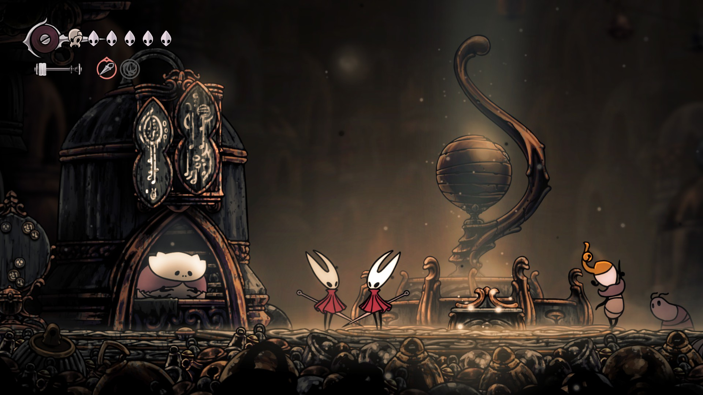
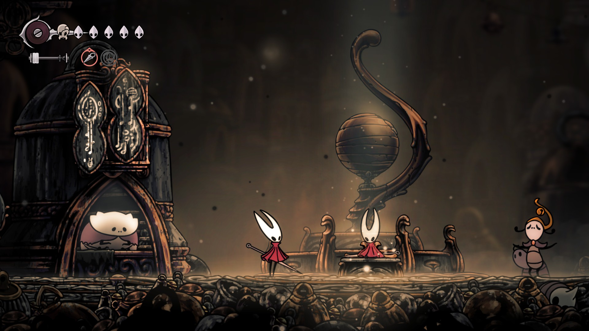
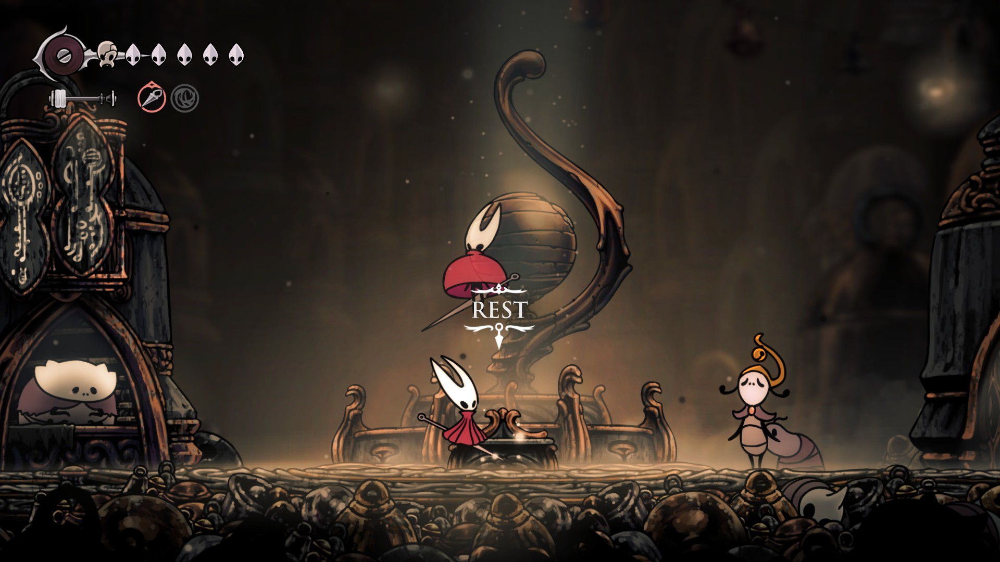
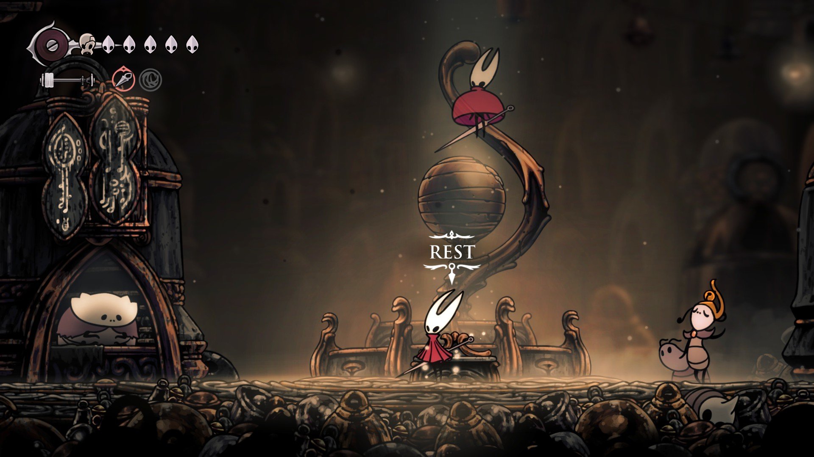
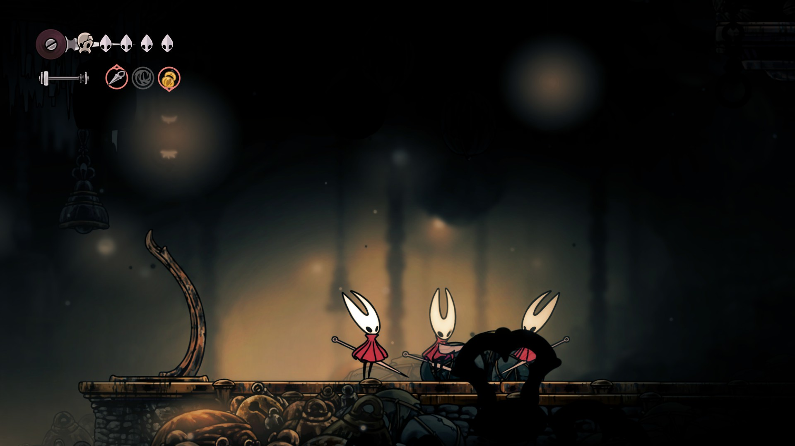
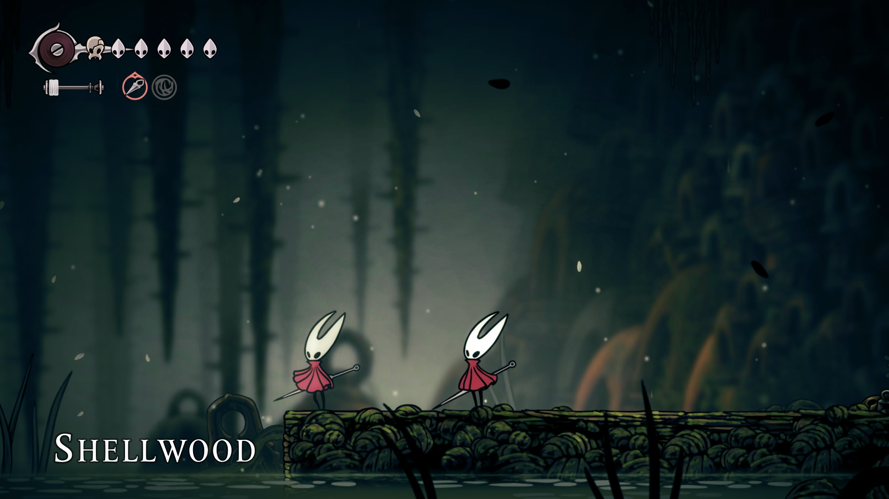
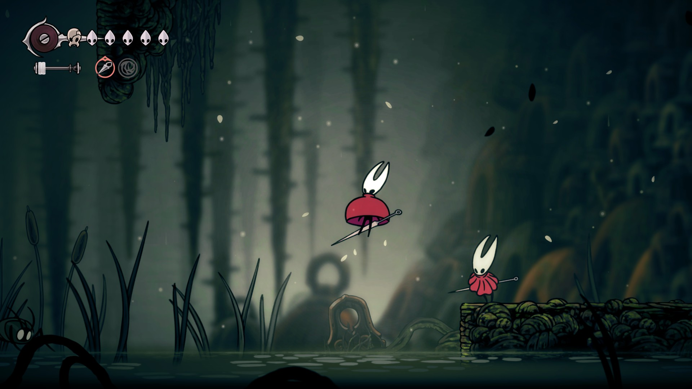
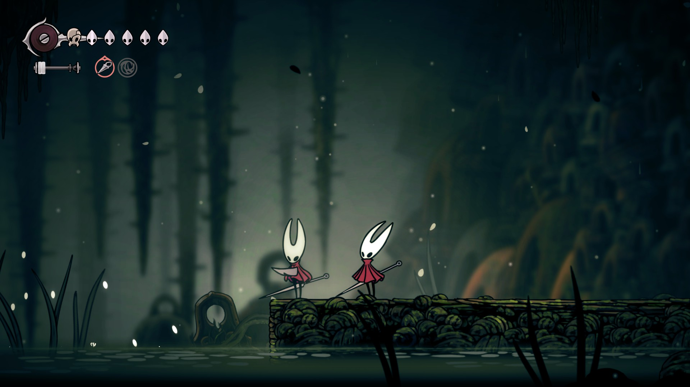
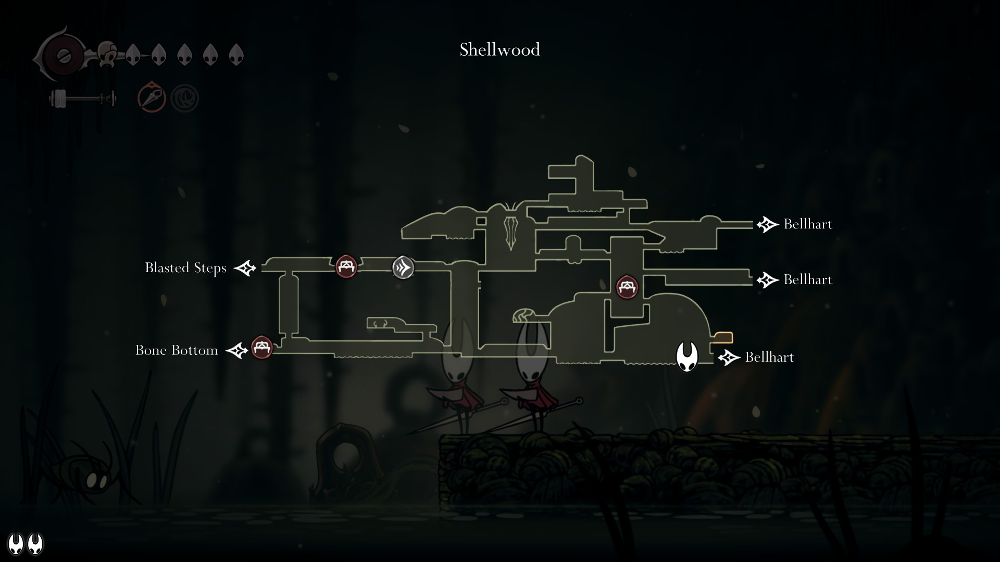

# SilklessCoopVisual

A simple coop mod based on SilklessLib that lets you see your friends while exploring Pharloom.

Requires [SilklessLib](https://github.com/nek5s/SilklessLib).

Requires [BepInEx 5.4.23.4](https://github.com/BepInEx/BepInEx/releases/tag/v5.4.23.4).

View the Nexusmods page [here](https://www.nexusmods.com/hollowknightsilksong/mods/73).

It currently features three modes:
- SteamP2P (all players need a valid steam version of the game)
- Standalone (requires a dedicated server)
- Debug (only used for internal testing)

Get 30% off on your dedicated server using affiliate code SILKLESS:

## Screenshots / Videos

Screenshots / Videos

## Installation

Download SilklessCoopVisual.zip from the [nexusmods](https://www.nexusmods.com/hollowknightsilksong/mods/73?tab=files) page and extract it into your root game folder.

## Features

- Shows connected players in game
- Shows connected players' animations
- Shows connected players' compasses on the map
- Shows the amount of connected players in the bottom left corner when viewing the quick map

## What's Next

- Bugfixes
- Sync sounds
- Sync other things (spoilers)
- Arrow to offscreen players

Syncing enemies is hard and will be (if at all) worked on in a separate mod in the future.

## Version History

Only major changes listed.

- 1.0 - Initial release
- 2.0 - Added steam support
- 2.1 - Added compass sync
- 2.2 - Added connection UI
- 2.4 - Improved animations
- 2.5 - Split into 2 repos

## License

This repository is licensed under CC BY-NC-SA.

See [here](./License) for details.
